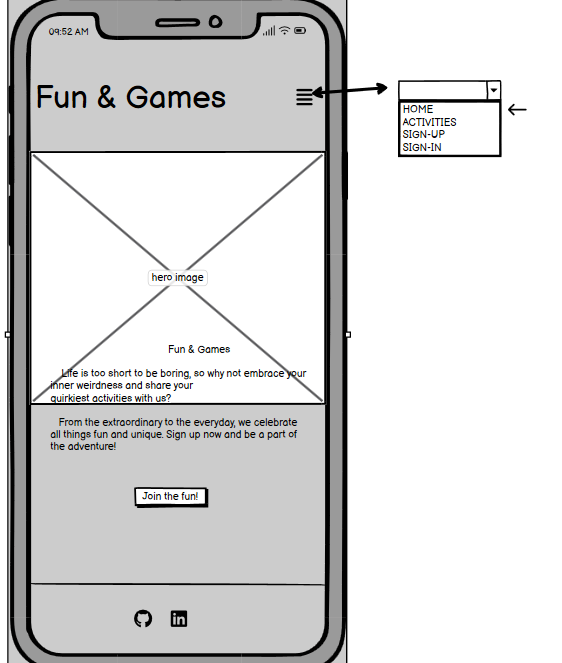
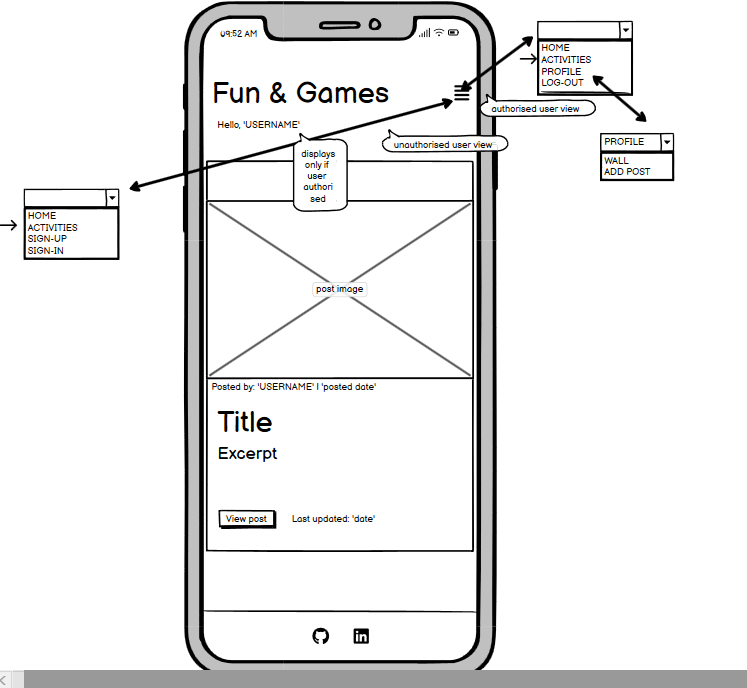
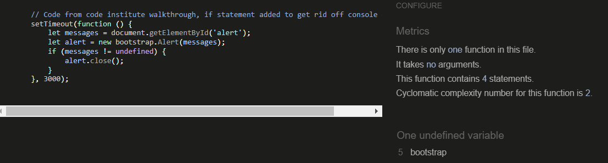

# Fun & Games

Fun & Games is an online portal where anyone can share and/or find interesting ideas on how to spend time in a fun way. Wheter you're simply bored of your routine or you're away and need an inspiration. Users can leave links to pages where they can book an event or simply find out more about a specific activity. Comments section allows users to communicate, share their own experiences or ask questions if needed. Sometimes all it takes to snap out of it is one click away..: [Live Page](https://fun-and-games-a99303d46c12.herokuapp.com/)

## Table of Contents

- [Fun & Games](#fun--games)
  - [Table of Contents](#table-of-contents)
- [User Experience Design](#user-experience-design)
  - [The Strategy Plane](#the-strategy-plane)
    - [Site Goals](#site-goals)
    - [Agile Planning](#agile-planning)
      - [Milestones](#milestones)
      - [User Stories](#user-stories)
  - [The Structure Plane](#the-structure-plane)
    - [Features](#features)
    - [Features Left To Implement](#features-left-to-implement)
  - [The Skeleton Plane](#the-skeleton-plane)
    - [Wireframes](#wireframes)
      - [Desktop](#desktop)
      - [Mobile](#mobile)
    - [Database Design](#database-design)
  - [The Surface Plane](#the-surface-plane)
    - [Design/ Colour-Scheme/ Font/ Images](#design-colour-scheme-font-images)
- [Technolgies](#technolgies)
  - [Tools and Technologies](#tools-and-technologies)
  - [Imports](#imports)
    - [Python Packages](#internal-packages)
    - [External Packages](#external-packages)
- [Testing](#testing)
  - [Responsiveness](#responsiveness)
  - [Accessibility](#accessibility)
  - [Lighthouse](#lighthouse)
  - [Validator Testing](#validator-testing)
    - [HTML](#html)
    - [CSS](#css)
    - [JavaScript](#javascript)
    - [Python](#python)
  - [Manual Testing](#manual-testing)
    - [Functional Testing](#functional-testing)
      - [Links and Buttons](#links-and-buttons)
      - [Negative Testing](#negative-testing)
  - [Automatic Testing](#automatic-testing)
    - [Unit Tests](#unit-tests)
- [Deployment](#deployment)
    - [Version Control](#version-control)
    - [Deploying in Heroku](#deploying-in-heroku)
    - [Cloning the Repository](#cloning-the-repository)
    - [Forking](#forking)
- [Credits](#credits)

# User Experience Design

## The Strategy Plane

### Site Goals

The site is aimed at anyone who wants to share an interesting and fun way to spend time. This could be anything from activity indoor, outdoor or great locations where you can book an experience with your family or friends.
It is also aimed at people who are simply searching for insporation when they're lacking ideas on what to do wheter it's due to a burn out, change of location or a need to experience new and crazy things.

### Agile Planning

The project was developed using agile methodology. Small features have been assigned to 6 milestones. This was then divided into 4 sprints. Labels have been used to mark which features the project : 'must have', 'should have', 'could have'. This was done so that I create a MVP in the time I have and only focus on the 'should have's' or 'could have's' if time allows. 
Each user story was closed if all acceptance criteria have been met.

Project board has been used to help me with the process [PROJECT BOARD-link](https://github.com/users/AsiaWi/projects/3/views/1?visibleFields=%5B%22Title%22%2C%22Assignees%22%2C%22Status%22%2C%22Milestone%22%2C%22Labels%22%5D)

#### Milestones

- 1-Project setup:
   This was a first task without it I wouldn't be able to continue with any of the project features so it was necessary to set up a basic structure of the project following the user stories included in this milestone.
- 2-Authentication:
   This milestone was needed to allow users to actually use the page so that the page is interactive
- 3-Post Functions:
   Includes all features enabling the CRUD functionality for the user
- 4-UX/UI:
   This improves users journey throughout the page and makes it a smooth experience for everyone.
- 5-Documentation:
   Needed to document the project
- 6-Final deployment: 
   Absolutely necessary step to make sure the page is deployed with no erros and allows anyone access to all features.

#### User Stories

 Each Milestone contains user stories allowing me to build up the project with small features:

- Milestone 1- Project setup
  - As a developer I need to set up the project so that I can build on it and create a mvp
     - Install Django
     - Create project
     - Add first main app
     - Add env.py file
     - Add Procfile
     - Install supporting libraries
     - image database - Cloudinary
     - database - ElephantSQL
     - Settings.py edited to notify django of the supporting libraries
     - Project deployed to Heroku
  - As a developer I need to add static files so that *the website is user friendly
  - As a developer I need to **create base.html file ** so that I have a basic structure of the page for the project
  - As a developer I need to create navigation menu so that a website user can easily navigate between pages
     - Home - for all users
     - SignUp - for unauthorised users
     - Login - for unauthorised users
     - LogOut- for authorised users
     - Profile (drop down) - for authorised users with function to:
       - view profile
       - add entry
  - As a developer I need to create a footer so that I can include social media links
  - As a developer I need to implement a superuser so that I can manage the website
- Milestone 2-Authentication:
  - As a developer I need to setup allauth so that users can have an option of signing up to the website for more features
     - Install allauth
     - Check that users can register/ login/logout of their account
- Milestone 3-Post Functions:
  - As a user I can add a post so that I can share an interesting activity location with others
  - As a post owner I want others to have an option to leave a like under a post so that I know it has been helpful for others
  - As a user I can add a comment to a post so that I can interact with others
  - As a user I can edit posts I have shared so that I can correct any errors or update if necessary
  - As a user I can open the post so that I can view the full post and it's details
  - As a user I can delete previously shared post so that I can make sure no posts which are no longer relevant based on location or my interests are showing for others 
  - As a user I can go to a page to view only my entries so that I can easily access them if needed
  - As a page user I can view all shared posts on the website so that I can find interesting activity ideas
- 4-UX/UI:
  - As a developer I need to create a home page so that user knows what the page is about from the moment they enter it
  - As a user I can navigate between pages so that the pages aren't too chaotic and overloaded
  - As a developer I can style the signup/login/logout pages in order to improve UI/UX 
  - As a user I can see confirmation messages when taking actions so that I know if they were successful or not
  - As a developer I need to implement 403 error page so that **user can see it when unauthorised to view certain content 
  - As a developer I need to implement 404 error page so that user is notified when accessing a link that doesn't exist
  - As a developer I need to implement error 500 page ** so that user gets notified in case of an internal error
- 5-Documentation:
  - As a developer I need to create readme.md file so that the project is supported by good documentation
- 6-Final deployment:
  - As a developer I need to make sure the project is deployed to heroku so that everything looks and works as it should do

## The Structure Plane

### Features

All features have been implemented with user stories in mind 

#### Navigation menu

``USER STORY As a developer I need to create navigation menu so that a website user can easily navigate between pages``

 - Nav bar when user authorised:
 

- This is shown the same on all pages for consistent design and good UX. Responsive design allows for hamburger bar on smaller screens. When user is logged in - a 'hello' message including username is displayed.
- The aim of the feature is so that the user can easily navigate around the page. Username shown is there for confirmation of logged in state for user on each page.  Options the user can select differ based on wheter the user is logged in or not. This is so that the nav bar isn't overcrowded and is simple to use.
     - Home - for all users
     - Activities - for all users
     - SignUp - for unauthorised users
     - SignIn - for unauthorised users
     - LogOut- for authorised users
     - Profile (drop down) - for authorised users with function to:
       - view profile (WALL)
       - add entry (ADD POST)

#### Home/Index Page

`` USER STORY: As a developer I need to create a home page so that user knows what the page is about from the moment they enter it``

- This is the first thing user is able to see when accessing the website. Quick message explains what the page is about and provides an invite to sign up. A welcoming hero image is supposed raise user's interests to explore the page more
- The aim of the page is to keep anyone who just entered the page interested and encourage to explore it more

#### Footer

`` USER STORY: As a developer I need to create a footer so that I can include social media links``

- This section includes social media links, as it's educational page only it includes links to my social media links
- The aim of this is so that the user can see more of my work if interested. If the page was real and had it's own social media the aim wouuld be the same

#### Sign-In/ Sign-Up/ Log-Out

Implementing this user story allows users to login/out and sign-up

`` USER STORY As a developer I need to setup allauth so that users can have an option of signing up to the website for more features``

Implementing this user story improves user experience whilst using the feature

``USER STORY: As a developer I can style the signup/login/logout pages in order to improve UI/UX ``

Each of the following pages are accessible through the navigation menu as explained above.

- These pages allow the user to sign up so that they have more options to interact with other pages or post their own.
- The aim of these features is so that the page is more interactive and users have access to their own posts.

#### Add Post

`` USER STORY: As a user I can add a post so that I can share an interesting activity location with others``

- This feature allows user to add their own post/entry. The following fields have been added:
   - Activity Title - required
   - Post Teaser (short teaser about the post content)- optional
   - Add image- required
   - Image description - required (img alt for users using assistive technology)
   - Describe Activity- required (main post content)
   - Can you leave a website link? - optional (this allows user to share any helpful links wheter it's a location to book an experience/class or simply more information about activity)
   - Publish post?- required ( This allows user to keep post private until ready to publish so that everyone can see it)

- The aim of this feature is so that they can share their own activities with others

#### Edit Post

`` USER STORY: As a user I can edit posts I have shared so that I can correct any errors or update if necessary``

 - CRUD functionality. This feature is available only if user is logged in and post belongs to the logged in user,when clicked:
   - user will be taken back to ' add post' form
   - if anauthorised user accesses link- the 403 error page will display. 
   - if user submits changes a message confirming that updates were saved will display if successful
 - The aim of this is so that is user makes any errors/ wants to update the post or simply changed mind and wants to change it from PUBLIC to PRIVATE (or the other way round)- they can update it here. 

 #### Delete Post 

 `` USER STORY: As a user I can delete previously shared post so that I can make sure no posts which are no longer relevant based on location or my interests are showing for others ``

 
 

 - CRUD functionality. This feature is available only if user is logged in and post belongs to the logged in user,when clicked:
    - user will be taken to confirm deletion page
    - if user clicks on 'no, go back to home page', post will not be deleted and user will be taken to home page
    - if user clicks on ' yes, continue', post will be deleted and a message confirming deletion will display. User will be taken back to own profile wall.
    - if anauthorised user accesses link- the 403 error page will display. 
 - The aim of this is for user to be able to delete any unwanted content 

 #### LIKES

 `` USER STORY: As a post owner I want others to have an option to leave a like under a post so that I know it has been helpful for others ``

 
 

 - This feature allows any logged inn user to like the post. When clicked:
   - Unauthorised user - will be taken to 'sign-in' page and upon successful login will be taken back to the post page
   - Authorised user - if didn't previously like the post - hollow heart icon will be displayed -if clicked - the icon will change to solid one and a number of likes will increase by one
   - Authorised user - if previously liked the post- solid heart icon will be shown- if clicked- the icon will change to hollow one and the number of likes will decrease by one.
  
#### COMMENTS

`` USER STORY: As a user I can add a comment to a post so that I can interact with others ``

 - As comments section is below the post, a link displaying a number of comments shows at the top of the post so that user can click on it and instead of scrolling down, the link will take a user to comments section. This helps if posts are long as it avoids a lot of scrolling.

 

 
 - This feature allows users to leave comments 
    - If user isn't logged in they will see a button to log in, once logged in they will be taken back to the post page

    
    - if user is logged in they will see a form to leave a comment, once submitted- a confirmation message will display at top of the screen and the comment will display below in comments section, if post has no comments yet a short message 'No comments yet.' will be displayed

     

     

#### List View

`` USER STORY: As a page user I can view all shared posts on the website so that I can find interesting activity ideas ``

 

 - This feature allows all users those who are logged in and not- to view posts shared by other users as long as the posts have been marked public at the time of creating it.
 - The preview of each posts features:
   - post image
   - posted by: 'username' | date_posted
   - Title
   - Teaser - if present
   - View post button to enter detailed view
   - Last Updated date if applicable
 - The aim of this feature is to allow users to find activities shared by others 

#### Profile Wall

`` USER STORY: As a user I can go to a page to view only my entries so that I can easily access them if needed ``

(update: I have changed Last updated to Created:)

- This feature has been implemented to allow users to view their own posts only, public and private- in one place.
- The preview of each posts shown on this list is a bit different than the one above. The user here knows that all posts are their own (message at top of the page) so no username on preview is needed. Instead, I have displayed ' date posted' and PRIVACY status so that user knows if each post is avaialable to public or not. 
- The aim of this feature is to make managinng posts more accessible, it allows the user to view the posts marked ' private' as well as public in one place. If user needs to access specific post and edit it or delete it they don't have t search through public list view where the posts are mixed with other users posts.
- If user hasn't posted anything yet - a message will be displayed informing them of this so that there is no confusion as to why the page is empty.

#### Post Detail View

`` USER STORY: As a user I can open the post so that I can view the full post and it's details ``

- This feature helps the user to view the entire post across whole page.
- This aim of this is to make it a nice experience for the user and not overcrowd each page. User can see clearly displayed features of the post:
   - Title
   - Teaser
   - Posted by:
   - Comments number - when clicked it will take the user to the bottom of the page where comments section is
   - Like function and number of likes
   - Image
   - Post content
   - Link to a website if available
   - Comment section
   

#### Page Pagination

`` USER STORY: As a user I can navigate between pages so that the pages aren't too chaotic and overloaded``

- This feature allows user to navigate between pages
- It has been implemented so that if there is many posts, the page isn't to overcrowded and chaotic. It allows the user to view 3 posts per page so posts are easy to find. No scrolling needed on large screens and not too much scrolling needed on mobiles.

#### Confirm Actions Messages

`` USER STORY: As a user I can see confirmation messages when taking actions so that I know if they were successful or not``

- This feature informs a user if action taken has been successful
- The aim of this feature is to keep the user informed if action they have taken has been successfuly performed, for example when leaving a comment, if successfully submitted- a message will be displayed to inform.
- Message will display when:
  - leaving comments
  - successfully deleted post
  - post edited
  - user signed in-out
  - post added

#### Error Pages

`` USER STORY: As a developer I need to implement 403 error page so that user can see it when unauthorised to view certain content ``

`` USER STORY: As a developer I need to implement 404 error page so that user is notified when accessing a link that doesn't exist ``

`` USER STORY: As a developer I need to implement error 500 page ** so that user gets notified in case of an internal error``

- This feature communicates to the user what went wrong and gives option to go back to home page
- The aim of this feature is to inform the user of an error taking place with a short descriptive message and helps the user find a way back to our page
(error 500 has been designed in exactly the same way as the other ones)

#### PROJECT SETUP/ FINAL TASKS

All the user stories below have been implemented in order to be able to build up on project/ finish it off:

`` As a developer I need to set up the project so that I can build on it and create a mvp 
    - Install Django
     - Create project
     - Add first main app
     - Add env.py file
     - Add Procfile
     - Install supporting libraries
     - image database - Cloudinary
     - database - ElephantSQL
     - Settings.py edited to notify django of the supporting libraries
     - Project deployed to Heroku ``
     
`` As a developer I need to add static files so that *the website is user friendly``

`` As a developer I need to **create base.html file ** so that I have a basic structure of the page for the project``

`` As a developer I need to implement a superuser so that I can manage the website``

`` As a developer I need to create readme.md file so that the project is supported by good documentation``

`` As a developer I need to make sure the project is deployed to heroku so that everything looks and works as it should do``

### Features left to implement

- In the future I would like to implement few extra features:
  - add a location model so that users can search through activities available in specific locations, I think this could be a really good one for people who like to travel don't know the area but would like to do something fun
  - add search bar to help to filter posts by location then.

## The Skeleton Plane

### Wireframes

#### Desktop

##### HOME PAGE authorised user/ unauthorised user

##### ACTIVITIES LIST VIEW authorised user/ unauthorised user

##### VIEW POST DETAILS authorised user/ unauthorised user

##### PROFILE WALL authorised user only

##### ADD ACTIVITY authorised user only

##### SIGN-UP, SIGN-IN unauthorised user only

##### LOGOUT authorised user only

#### Mobile

##### HOME PAGE authorised user/ unauthorised user

##### ACTIVITIES LIST VIEW authorised user/ unauthorised user

##### VIEW POST DETAILS authorised user/ unauthorised user

##### PROFILE WALL authorised user only

##### ADD ACTIVITY authorised user only

##### SIGN-UP, SIGN-IN unauthorised user only

##### LOGOUT authorised user only

### Database design

- The ER Diagram has been generated with DBeaver. 
- The diagram shows relationships between models
  - The user model supports pretty much all existing features and allows user to interact with posts when logged in with the help of foreign key
  - The activity model also supports comments and likes

## The Surface Plane

### Design/ Colour-Scheme/ Font/ Images

- The design of the page has been kept clean and simple with room to develop in the future. The clean design still makes it a visualy pleasant experience. 
- The main/ hero image will hopefully bring happy emotions to user entering the page
- Main colour used througout the page is blue extending the theme of the hero image.

## Technologies

### Tools and technologies

* Visual Studio Code - used to develop the website
* Github - used to host source code and deploy on Github Pages
* Git- used to commit and push code 
* HTML - used to create main static content of the website
* Bootstrap - front end framework used 
* CSS- used for website styling
* JavaScript- used to create dynamic content and make page interactive
* Python - used as the main language to code the logic of the page
* Django - framework used
* Heroku - to deploy the app 
* [Balsamiq](https://balsamiq.com/wireframes/)- used to create wireframes
* [Favicon](https://favicon.io/favicon-generator/) - used to create favicon for the page
* [Font Awesome](https://fontawesome.com/) - used to add icons for the page
* [Tiny PNG](https://tinypng.com/)- used to compress the size of background
* [WEBP CONVERTER](https://cloudconvert.com/webp-converter) -used to convert background image, 
* [Wave Evaluation Tool](https://wave.webaim.org/)- used for checking accessibility
* [Techsini](https://techsini.com/multi-mockup/index.php)- used for creating mockup image
* [W3C Validator](https://validator.w3.org/)- used for checking HTML and CSS for errors
* [jshint Validator](https://jshint.com/) - used to check java script code for errors
* [dbeaver](https://dbeaver.com/) - used to generate the ER Diagram
* [css gradient](https://cssgradient.io/) - used for <main> background
* [Table Markdown](https://tabletomarkdown.com/)- to create tables in readme 

### Imports

#### Python packages

* QuillField - used to provide an editor for user when adding post content
* timezone - to display current time on comment submission
* TemplateView, CreateView, ListView, DetailView, DeleteView, UpdateView - used to allow CRUD functionality
* LoginRequiredMixin, UserPassesTestMixin - used to test and secure views from unauthorised access.
* messages - used to add action messages to user on submission
* HttpResponseRedirect, reverse : used to direct user to specific URL
* get_object_or_404: used to get specific object from database or raise 404 exception if not found

#### External packages

* cloudinary==1.34.0 - media managment cloudinary
* dj3-cloudinary-storage==0.0.6 - cloudinary storage
* dj-database-url==0.5.0  - Django utility allows to utilize DATABASE_URL environment variable to configure Django application
* psycopg2==2.9.7 - additional dependency needed to support PostgreSQL when deployed to heroku  
* Django==3.2.21  - Framework used to buold the project
* django-allauth==0.56.1  - authentication in django allowing user to sign- up/ sign-in/log-out
* requests-oauthlib==1.3.1 - installed with the allauth above
* django-crispy-forms==1.14.0 - enabling me to display forms to user
* django-quill-editor==0.1.40 - editor provided to user when adding post content
* django-resized==1.0.2  - resizes images provided by user to specific size

Installed as dependencies with another packages:
* gunicorn==21.2.0
* oauthlib==3.2.2
* PyJWT==2.8.0
* python3-openid==3.2.0
* sqlparse==0.4.4
* urllib3==1.26.16

## Testing

### Responsiveness

Website has been checked for responsiveness through Development tools. In order to do this, the following steps have been taken:
1. Open browser
2. Navigate to Fun & Games at https://fun-and-games-a99303d46c12.herokuapp.com/playground/
3. Right click anywhere on the page and go to "Inspect" to open Development Tools
4. Click on drop down menu: "Dimensions: Responsive" and choose "Responsive"
5. Drag the side of the screen and change screen size, make sure the website looks good from 320px and up. Make sure no side 
   scroll bar is showing.

* Expected- page is user friendly when viewing the website on small and large screens.
* Actual- website looks good, no bottom scroll bar showing, all content clearly visible. Website is user friendly on all screen sizes.

* The following devices have been used to check responsiveness:
    * Iphone 13 Pro
    * Google Pixel 7 Pro 
    * Asus Vivobook

### Accessibility

!!!!!!!!! check WAVE on quil!!!!!!!!!!!!!!!!1 to do

Each page checked with the help of WAVE Accessibility tool (https://wave.webaim.org/). Each page passes accesibility test with no error for:
* contrast
* aria- labels for users who use screen-readers
* alternative text as a function for screen readers or in events when images don't load
* structural elements - for users of assistive technology as well as visual and semantic meaning
* language of the document- for screen readers

* an alert coming up 'Reduntant link-Adjacent links go to the same URL', however as it doesn't come up as an error, I have left it in' This is due to page logo and Home page having the same destination link.

### Lighthouse

* HOME PAGE (desktop & mobile)

*  ACTIVITIES list view (desktop & mobile)

* VIEW POST DETAILS page (desktop & mobile)

* ADD POST (desktop & mobile)

to be added when issues with this page get sorted

### Validator Testing

#### HTML

All pages have been run through the [W3C VALIDATOR](https://validator.w3.org/).

In order to check HTML code in dynamic website:

* go to the live page
* click right and select 'Inspect' then click right and select 'View page source'
* code will open in new tab - copy the code
* paste the code in the validator as 'direct input'

All pages have passed the check:
* Home page (index.html)
* Activities list view (activities.html)
* Sign-in, sign-out, log-out pages
* Profile Wall page (profile_wall.html)
* Confirm post deletion page (activity_confirm_delete.html)
* Post detail view, own posts(when edit and delete show) and [posts that belong to other users (view_activity_details.html)

ADD POST AND EDIT POST COME UP WITH ERROR WILL BE FIXED AND ADDED TO THE LIST

#### CSS

No errors were found when passing through the official Jigsaw W3 Validator

#### JavaScript

No errors were found when passing through the [jshint validator](https://jshint.com/)

#### Python

No errors shows when passing each file through [CI Python Linter](https://pep8ci.herokuapp.com/)

Each python file in this repo has been run through and each file received the same success message:

### Manual Testing

#### Functional Testing

| FUNCTION                                                           | ACTION                                                                                                                                                                                        | EXPECTED                                                                                                                                                                                                                                                                                                                                             | ACTUAL      |
| ------------------------------------------------------------------ | --------------------------------------------------------------------------------------------------------------------------------------------------------------------------------------------- | ---------------------------------------------------------------------------------------------------------------------------------------------------------------------------------------------------------------------------------------------------------------------------------------------------------------------------------------------------- | ----------- |
| sign-up                                                            | user clicks- 'sign-up' or 'join the fun', user enters username, password and repeats password,(email optional) user clicks- 'sign-up>>'                                                       | user directed to home page, user receives a message of successful action, 'hello "username"' message displays in top right corner of nav bar                                                                                                                                                                                                         | as expected |
| sign-in                                                            | user clicks- 'sign-in' from nav bar or from sign-up page if entered it but already holds login details, user enters correct username and password, user clicks- 'sign-in'                     | user directed to home page, user receives a message of successful action, 'hello "username"' message displays in top right corner of nav bar                                                                                                                                                                                                         | as expected |
| log-out                                                            | user clicks ' log-out' from nav bar, sign-out page displays to confirm sign-out, user confirms by clicking ' sign-out'                                                                        | user directed to home page, user receives a message of successful action, 'hello "username"' no longer displays in top right corner of nav bar                                                                                                                                                                                                       | as expected |
| activities tab                                                     | user clicks on 'activities' tab from nav bar                                                                                                                                                  | user directed to activities.html, a list of 'public' posts available to view regardles of auth state. User can see 3 posts per page and pagination navigation available below posts if more than 3 available                                                                                                                                         | as expected |
| pagination navigation (from activities.html or profile_wall.html)  | user on page 1: can see and clicks on: any page number available, next, last. If user is not on page 1-user can see and click on : first, previous or any page number available               | user gets directed to relevant and correct page depending on which option was clicked                                                                                                                                                                                                                                                                | as expected |
| view post (from list view on activities.html or profile_wall.html) | user hovers over ' view post' button, button changes color to dark when hovered over, user clicks on the button                                                                               | view_post_detail page rendered for user, user can see correct post in detail                                                                                                                                                                                                                                                                         | as expected |
| Like function (from view_post_detail page)                         | 1.logged in user clicks on hollow heart icon 2. logged in user clicks on the solid heart icon 3. unauthorised user clicks on heart icon                                                       | 1\. icon changes to solid and number of likes increases by one. 2.icon changes to hollow and number of likes decreases by 1 // 3. user directed to login page (if user doesn't own login details the page also contains 'sign-up' option), user enters correct login details and clicks 'sign-in', user redirected back to view the same post.       | as expected |
| login to leave a comment : sign-in (from view_post_detail page)    | user clicks on 'sign-in', user enters correct username and password, then clicks ' sign in'                                                                                                   | user redirected back to the same post page, user can see success message at the top of the screen. upon scrolling down to comments section- user can now see submission form to leave a comment instead of sign-in option                                                                                                                            | as expected |
| leave comment form                                                 | user types up a comment and clicks submit                                                                                                                                                     | users comment now displays in comments section below the comment form. Comments show in chronological order                                                                                                                                                                                                                                          | as expected |
| PROFILE' --> 'WALL'                                                | logged in user clicks on PROFILE from nav bar then 'WALL' from drop down.                                                                                                                     | user directed to profile_wall.html, a list of only users own posts- 'public' and 'private' available to view. User can see 3 posts per page and pagination navigation available below posts if more than 3 available. If user didn't submit any posts yet a message will be displayed 'You haven't added any posts yet'                              | as expected |
| PROFILE --> ADD POST                                               | logged in user clicks on PROFILE from nav bar then 'ADD POST' from drop down.                                                                                                                 | user directed to add_post page where they can see submission form for posts                                                                                                                                                                                                                                                                          | as expected |
| ADD POST form                                                      | user enters all fields marked as required with an '\*', the optional fields can either stay empty or be filled in- user clicks 'submit'                                                       | user directed back to profile_wall page, a success message displays on the top of the page, user now can see the added post in list view on profile wall. If user submitted the post as private- post displays only on profile wall, if post was marked as public- post displays on profile wall and get's added to list view on activities.html too | as expected |
| DELETE post (view_post_details page )                              | user can only see ' delete' button on own posts. User clicks on 'delete'. User directed to confirm post deletion page. 1. user clicks'yes. continue' 2.user clicks 'no.go back to my profile' | 1\. user taken back to profile_wall, success message displayed at the top of the page, post deleted 2. user directed back to profile_wall . post remains on account                                                                                                                                                                                  | as expected |
| EDIT post (view_post_details page)                                 | user can only see ' EDIT' button on own posts. User clicks on 'EDIT'. User directed to a form with post details. User can change any field and click submit.                                  | user directed back to profile_wall page, success message displays if post updated succesfully. User can still see the post in list view (PLEASE NOTE FORM SUBMITTION HERE AND WHERE THE POST WILL BE DISPLAYED IN LIST VIEW IS THE SAME AS IN ' ADD POST' FUNCTION. )                                                                                | as expected |

##### Links and Buttons

| BUTTON/ANCHOR LINK/ LOCATION                                                   | DESTINATION PAGE                                                                                                                                                   | PAGE OPENS IN NEW TAB                |
| ------------------------------------------------------------------------------ | ------------------------------------------------------------------------------------------------------------------------------------------------------------------ | ------------------------------------ |
| Fun&Games' logo-nav bar                                                        | index.html                                                                                                                                                         | no-as expected                       |
| HOME'- nav bar                                                                 | index.html                                                                                                                                                         | no-as expected                       |
| ACTIVITIES'- nav bar                                                           | activities.html                                                                                                                                                    | no-as expected                       |
| PROFILE' --> WALL-nav bar(logged in users only)                                | profile_wall.html                                                                                                                                                  | no-as expected                       |
| PROFILE --> ADD POST- nav bar (logged in users only)                           | add_activity.html                                                                                                                                                  | no-as expected                       |
| LOG-OUT- nav bar(logged in users only)                                         | logout.html                                                                                                                                                        | no-as expected                       |
| JOIN THE FUN'- from index.html(unauthorised users only)                        | signup.html                                                                                                                                                        | no-as expected                       |
| SIGN-UP- nav bar (unauthorised users only)                                     | signup.html                                                                                                                                                        | no-as expected                       |
| SIGN-IN- nav bar (unauthorised users only)                                     | login.html                                                                                                                                                         | no-as expected                       |
| Commented: (no. of comments)' link from view_activity_details.html             | scrolls down to comments section below posts                                                                                                                       | no-as expected                       |
| SIGN-IN -comments section, view_activity_details.html(unauthorised users only) | login.html                                                                                                                                                         | no-as expected                       |
| EDIT- view_activity_details.html(on users own posts only)                      | edit_activity.html                                                                                                                                                 | no-as expected                       |
| DELETE- viw_activity_details.html(on users own posts only)                     | activity_confirm_delete.html                                                                                                                                       | no-as expected                       |
| LIKE -view_activity_details.html(when unauthorised)                            | login.html                                                                                                                                                         | no-as expected                       |
| GITHUB ICON- footer                                                            | [https://github.com/AsiaWi](https://github.com/AsiaWi)                                                                                                             | yes-as expected                      |
| LINKEDIN ICON- footer                                                          | [https://www.linkedin.com/in/joanna-witek-51017b263/](https://www.linkedin.com/in/joanna-witek-51017b263/)                                                         | yes-as expected                      |
| LINK provided by user within their posts                                       | this will only work correctly if user submits the post with correct link. I have added a message within the form for user to pay attention if the link is correct. | yes-as expected (if link is correct) |

##### Negative Testing

| FUNCTION      | ACTION                                                                                                                                                                            | EXPECTED                                                                                                | ACTUAL      |
| ------------- | --------------------------------------------------------------------------------------------------------------------------------------------------------------------------------- | ------------------------------------------------------------------------------------------------------- | ----------- |
| EDIT post     | 1.user tries to access URL to edit post but not logged in 2. user tries to access the url from different username                                                                 | 1.user directed to login page 2. user receives error 403                                                | as expected |
| DELETE post   | 1.user tries to access URL to delete post but not logged in 2. user tries to access the url from different username                                                               | 1.user directed to login page 2. user receives error 403                                                | as expected |
| SIGN-UP       | user doesn't fill in all required fields(username and password twice),user enters password twice but doesn't match, username enters too common password or less than 8 characters | user received a prompt with directions, sign up unsuccessful, user can enter details again              | as expected |
| ADD POST form | user doesn't fill in all required fields( these are marked with \*)                                                                                                               | user receives a prompt to fill in the required field. form doesn't submit. user can enter details again | as expected |
| COMMENT form  | user tried to submit empty comment form                                                                                                                                           | user receives prompt to fill in the form field, no submission present                                   | as expected |
| SIGN-IN       | user doesn't fill in all required fields(username and password). user enters incorrect username or password                                                                       | user receives prompt why sign-in is unsuccessful and can enter details again                            | as expected |

### Automatic Testing

#### Unit Testing

No unit testing performed at this stage. 

## Deployment

### Version Control

* Git 
    Code has been pushed with git commands to remote repository on Github with commands:

   `` git add .`` - to add files ready to commit

   ``git commit -m "message"`` - to commit the code to local 
    repository ready to be pushed

   ``git push`` - final command used to push commited code to remote repo on Github
   
### Deploying in Heroku 

* The project has been deployed on Heroku as follows:
     * Use: ``pip freeze > requirements.txt`` to add external libraries to deployed app.
     * Create Heroku account ( step by step guide [here](https://coding-boot-camp.github.io/full-stack/heroku/deploy-with-heroku-and-mysql))
     * In the top right, click 'New'
     * Click 'Create new app'
     * Give your app a name and select your region from drop down 
     * Click 'Create new app' 
     * Go to 'settings' tab, it's important you do it before deployment
     * Scroll down to 'config vars' section and key:
        - PORT and value: 8000
        - CLOUDINARY_URL: ''
        - DATABASE_URL : ''
        - SECRET_KEY: ''
     * Scroll down to 'Buildpacks' section
     * Click 'Add buildpack'
     * Add Python as first dependency and select 'Save changes'
     * Add node.js as a second dependency and save again
     (This is settings section done)
     * Select 'Deploy' tab at the top
     * Select ' Github' from 'Deployment method'
     * type the name of how you called project in Github and click 'search'
     * Scroll down and select manual deployment method
     * Auto method has also been selected to allow the project to update every time i push the code from Gitpod
     * You can now click to view the app ready and running

### CLONING THE REPOSITORY

1. On Github navigate to repository
2. Click "Code" a green button shown right above the file list
3. Copy the URL of the repo using HTTPS, SSH OR Github CLI
4. Open Git Bash
5. Change the current working directory to the location where you want the cloned directory
6. Type git clone, and then paste the URL you copied earlier
7. Press enter to create local Clone

For more details on how to clone the remote repo in order to create a local copy for own use, please click [here](https://docs.github.com/en/repositories/creating-and-managing-repositories/cloning-a-repository)

### FORKING

1. On Github navigate to repository
2. click "Fork" located towards the top right corner
3. Select "owner" for the forked repo, from the dropdown menu under "owner" Under "Owner"
4. It will create forked repo under the same name as orinial by default but you can type a name in "Repository name" or add a description in "Description" box.
5. Click "Create fork" !

Forking allows you to make any changes without affecting original project. You can send the suggestions over by submitting pull request. Project owner can review the pull request before accepting the suggestions and merging them.

For more details on how to fork the repo, in order to for example suggest any changes to the project you can click [here](https://docs.github.com/en/get-started/quickstart/fork-a-repo) 

When you have fork to a repository you don't have access to files locally on your device, for this you will need to clone the forked repo.

## Credits

- [Receipe tutorial](https://www.youtube.com/watch?v=iYrFRi8GZOw&list=PLXuTq6OsqZjbCSfiLNb2f1FOs8viArjWy&index=12)- used throughout to help me with the project. 
- [Likes tutorial](https://dev.to/radualexandrub/how-to-add-like-unlike-button-to-your-django-blog-5gkg) - which I have used to add 'like' feature in my project
- [Django messages](https://ordinarycoders.com/blog/article/django-messages-framework)- used to help me with adding messages to my project
- [Active class for nav links](https://tekshinobi.com/setting-active-navbar-link-in-django-template/) - used to add active class in my nav links
- [Rawpixel](https://www.rawpixel.com/) - Hero Image 
- [Readme](https://github.com/Gareth-McGirr/Portfolio-Project-4-SizzleAndSteak/tree/main) - used for readme structure
- [Worldtravellog](https://github.com/URiem/worldtravellog/tree/main) & [SizzleAndSteak](https://github.com/Gareth-McGirr/Portfolio-Project-4-SizzleAndSteak/tree/main) - have also been helpful with gathering my thoughts together to start and then as general help 
- Stack Overflow and google which have been super helpful with django issues
- Code Insitute's django material

