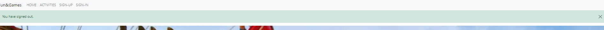

# Fun & Games

Fun & Games is an online portal where anyone can share and/or find interesting ideas on how to spend time in a fun way. Wheter you're simply bored of your routine or you're away and need an inspiration. Users can leave links to pages where they can book an event or simply find out more about a specific activity. Comments section allows users to communicate, share their own experiences or ask questions if needed. Sometimes all it takes to snap out of it is one click away..: [Live Page](https://fun-and-games-a99303d46c12.herokuapp.com/)

## Table of Contents
- [Fun & Games](#fun-&-games)
  - [Table of Contents](#table-of-contents)
- [User Experience Design](#user-experience-design)
  - [The Strategy Plane](#the-strategy-plane)
    - [Site Goals](#site-goals)
    - [Agile Planning](#agile-planning)
      - [Milestones](#milestones)
      - [User Stories](#user-stories)
  - [The Structure Plane](#the-structure-plane)
    - [Features](#features)
    - [Features Left To Implement](#features-left-to-implement)
  - [The Skeleton Plane](#the-skeleton-plane)
    - [Wireframes](#wireframes)
    - [Database Design](#database-design)
# User Experience Design

## The Strategy Plane

### Site Goals
The site is aimed at anyone who wants to share an interesting and fun way to spend time. This could be anything from activity indoor, outdoor or great locations where you can book an experience with your family or friends.
It is also aimed at people who are simply searching for insporation when they're lacking ideas on what to do wheter it's due to a burn out, change of location or a need to experience new and crazy things.

### Agile Planning

The project was developed using agile methodology. Small features have been assigned to 6 milestones. This was then divided into 4 sprints. Labels have been used to mark which features the project : 'must have', 'should have', 'could have'. This was done so that I create a MVP in the time I have and only focus on the 'should have's' or 'could have's' if time allows. 
Each user story was closed if all acceptance criteria have been met.

Project board has been used to help me with the process [PROJECT BOARD-link](https://github.com/users/AsiaWi/projects/3/views/1?visibleFields=%5B%22Title%22%2C%22Assignees%22%2C%22Status%22%2C%22Milestone%22%2C%22Labels%22%5D)

#### Milestones
- 1-Project setup:
   This was a first task without it I wouldn't be able to continue with any of the project features so it was necessary to set up a basic structure of the project following the user stories included in this milestone.
- 2-Authentication:
   This milestone was needed to allow users to actually use the page so that the page is interactive
- 3-Post Functions:
   Includes all features enabling the CRUD functionality for the user
- 4-UX/UI:
   This improves users journey throughout the page and makes it a smooth experience for everyone.
- 5-Documentation:
   Needed to document the project
- 6-Final deployment: 
   Absolutely necessary step to make sure the page is deployed with no erros and allows anyone access to all features.

#### User Stories
 Each Milestone contains user stories allowing me to build up the project with small features:

- Milestone 1- Project setup
  - As a developer I need to set up the project so that I can build on it and create a mvp
     - Install Django
     - Create project
     - Add first main app
     - Add env.py file
     - Add Procfile
     - Install supporting libraries
     - image database - Cloudinary
     - database - ElephantSQL
     - Settings.py edited to notify django of the supporting libraries
     - Project deployed to Heroku
  - As a developer I need to add static files so that *the website is user friendly
  - As a developer I need to **create base.html file ** so that I have a basic structure of the page for the project
  - As a developer I need to create navigation menu so that a website user can easily navigate between pages
     - Home - for all users
     - SignUp - for unauthorised users
     - Login - for unauthorised users
     - LogOut- for authorised users
     - Profile (drop down) - for authorised users with function to:
       - view profile
       - add entry
  - As a developer I need to create a footer so that I can include social media links
  - As a developer I need to implement a superuser so that I can manage the website
- Milestone 2-Authentication:
  - As a developer I need to setup allauth so that users can have an option of signing up to the website for more features
     - Install allauth
     - Check that users can register/ login/logout of their account
- Milestone 3-Post Functions:
  - As a user I can add a post so that I can share an interesting activity location with others
  - As a post owner I want others to have an option to leave a like under a post so that I know it has been helpful for others
  - As a user I can add a comment to a post so that I can interact with others
  - As a user I can edit posts I have shared so that I can correct any errors or update if necessary
  - As a user I can open the post so that I can view the full post and it's details
  - As a user I can delete previously shared post so that I can make sure no posts which are no longer relevant based on location or my interests are showing for others 
  - As a user I can go to a page to view only my entries so that I can easily access them if needed
  - As a page user I can view all shared posts on the website so that I can find interesting activity ideas
- 4-UX/UI:
  - As a developer I need to create a home page so that user knows what the page is about from the moment they enter it
  - As a user I can navigate between pages so that the pages aren't too chaotic and overloaded
  - As a developer I can style the signup/login/logout pages in order to improve UI/UX 
  - As a user I can see confirmation messages when taking actions so that I know if they were successful or not
  - As a developer I need to implement 403 error page so that **user can see it when unauthorised to view certain content 
  - As a developer I need to implement 404 error page so that user is notified when accessing a link that doesn't exist
  - As a developer I need to implement error 500 page ** so that user gets notified in case of an internal error
- 5-Documentation:
  - As a developer I need to create readme.md file so that the project is supported by good documentation
- 6-Final deployment:
  - As a developer I need to make sure the project is deployed to heroku so that everything looks and works as it should do

## The Structure Plane

### Features
All features have been implemented with user stories in mind 

#### Navigation menu
``USER STORY As a developer I need to create navigation menu so that a website user can easily navigate between pages``

 - Nav bar when user authorised:
 

- This is shown the same on all pages for consistent design and good UX. Responsive design allows for hamburger bar on smaller screens. When user is logged in - a 'hello' message including username is displayed.
- The aim of the feature is so that the user can easily navigate around the page. Username shown is there for confirmation of logged in state for user on each page.  Options the user can select differ based on wheter the user is logged in or not. This is so that the nav bar isn't overcrowded and is simple to use.
     - Home - for all users
     - Activities - for all users
     - SignUp - for unauthorised users
     - SignIn - for unauthorised users
     - LogOut- for authorised users
     - Profile (drop down) - for authorised users with function to:
       - view profile (WALL)
       - add entry (ADD POST)

#### Home/Index Page
`` USER STORY: As a developer I need to create a home page so that user knows what the page is about from the moment they enter it``

- This is the first thing user is able to see when accessing the website. Quick message explains what the page is about and provides an invite to sign up. A welcoming hero image is supposed raise user's interests to explore the page more
- The aim of the page is to keep anyone who just entered the page interested and encourage to explore it more

#### Footer
`` USER STORY: As a developer I need to create a footer so that I can include social media links``

- This section includes social media links, as it's educational page only it includes links to my social media links
- The aim of this is so that the user can see more of my work if interested. If the page was real and had it's own social media the aim wouuld be the same

#### Sign-In/ Sign-Up/ Log-Out
Implementing this user story allows users to login/out and sign-up

`` USER STORY As a developer I need to setup allauth so that users can have an option of signing up to the website for more features``

Implementing this user story improves user experience whilst using the feature

``USER STORY: As a developer I can style the signup/login/logout pages in order to improve UI/UX ``

Each of the following pages are accessible through the navigation menu as explained above.

- These pages allow the user to sign up so that they have more options to interact with other pages or post their own.
- The aim of these features is so that the page is more interactive and users have access to their own posts.

#### Add Post
`` USER STORY: As a user I can add a post so that I can share an interesting activity location with others``

- This feature allows user to add their own post/entry. The following fields have been added:
   - Activity Title - required
   - Post Teaser (short teaser about the post content)- optional
   - Add image- required
   - Image description - required (img alt for users using assistive technology)
   - Describe Activity- required (main post content)
   - Can you leave a website link? - optional (this allows user to share any helpful links wheter it's a location to book an experience/class or simply more information about activity)
   - Publish post?- required ( This allows user to keep post private until ready to publish so that everyone can see it)

- The aim of this feature is so that they can share their own activities with others

#### Edit Post
`` USER STORY: As a user I can edit posts I have shared so that I can correct any errors or update if necessary``

 - CRUD functionality. This feature is available only if user is logged in and post belongs to the logged in user,when clicked:
   - user will be taken back to ' add post' form
   - if anauthorised user accesses link- the 403 error page will display. 
   - if user submits changes a message confirming that updates were saved will display if successful
 - The aim of this is so that is user makes any errors/ wants to update the post or simply changed mind and wants to change it from PUBLIC to PRIVATE (or the other way round)- they can update it here. 

 #### Delete Post 
 `` USER STORY: As a user I can delete previously shared post so that I can make sure no posts which are no longer relevant based on location or my interests are showing for others ``

 
 

 - CRUD functionality. This feature is available only if user is logged in and post belongs to the logged in user,when clicked:
    - user will be taken to confirm deletion page
    - if user clicks on 'no, go back to home page', post will not be deleted and user will be taken to home page
    - if user clicks on ' yes, continue', post will be deleted and a message confirming deletion will display. User will be taken back to own profile wall.
    - if anauthorised user accesses link- the 403 error page will display. 
 - The aim of this is for user to be able to delete any unwanted content 

 #### LIKES
 `` USER STORY: As a post owner I want others to have an option to leave a like under a post so that I know it has been helpful for others ``

 
 

 - This feature allows any logged inn user to like the post. When clicked:
   - Unauthorised user - will be taken to 'sign-in' page and upon successful login will be taken back to the post page
   - Authorised user - if didn't previously like the post - hollow heart icon will be displayed -if clicked - the icon will change to solid one and a number of likes will increase by one
   - Authorised user - if previously liked the post- solid heart icon will be shown- if clicked- the icon will change to hollow one and the number of likes will decrease by one.
  
#### COMMENTS
`` USER STORY: As a user I can add a comment to a post so that I can interact with others ``

 - As comments section is below the post, a link displaying a number of comments shows at the top of the post so that user can click on it and instead of scrolling down, the link will take a user to comments section. This helps if posts are long as it avoids a lot of scrolling.

 

 
 - This feature allows users to leave comments 
    - If user isn't logged in they will see a button to log in, once logged in they will be taken back to the post page

    
    - if user is logged in they will see a form to leave a comment, once submitted- a confirmation message will display at top of the screen and the comment will display below in comments section, if post has no comments yet a short message 'No comments yet.' will be displayed

     

     

#### List View

`` USER STORY: As a page user I can view all shared posts on the website so that I can find interesting activity ideas ``

 

 - This feature allows all users those who are logged in and not- to view posts shared by other users as long as the posts have been marked public at the time of creating it.
 - The preview of each posts features:
   - post image
   - posted by: 'username' | date_posted
   - Title
   - Teaser - if present
   - View post button to enter detailed view
   - Last Updated date if applicable
 - The aim of this feature is to allow users to find activities shared by others 

#### Profile Wall
`` USER STORY: As a user I can go to a page to view only my entries so that I can easily access them if needed ``

(update: I have changed Last updated to Created:)

- This feature has been implemented to allow users to view their own posts only, public and private- in one place.
- The preview of each posts shown on this list is a bit different than the one above. The user here knows that all posts are their own (message at top of the page) so no username on preview is needed. Instead, I have displayed ' date posted' and PRIVACY status so that user knows if each post is avaialable to public or not. 
- The aim of this feature is to make managinng posts more accessible, it allows the user to view the posts marked ' private' as well as public in one place. If user needs to access specific post and edit it or delete it they don't have t search through public list view where the posts are mixed with other users posts.
- If user hasn't posted anything yet - a message will be displayed informing them of this so that there is no confusion as to why the page is empty.

#### Post Detail View
`` USER STORY: As a user I can open the post so that I can view the full post and it's details ``

- This feature helps the user to view the entire post across whole page.
- This aim of this is to make it a nice experience for the user and not overcrowd each page. User can see clearly displayed features of the post:
   - Title
   - Teaser
   - Posted by:
   - Comments number - when clicked it will take the user to the bottom of the page where comments section is
   - Like function and number of likes
   - Image
   - Post content
   - Link to a website if available
   - Comment section
   

#### Page Pagination
`` USER STORY: As a user I can navigate between pages so that the pages aren't too chaotic and overloaded``

- This feature allows user to navigate between pages
- It has been implemented so that if there is many posts, the page isn't to overcrowded and chaotic. It allows the user to view 3 posts per page so posts are easy to find. No scrolling needed on large screens and not too much scrolling needed on mobiles.

#### Confirm Actions Messages
`` USER STORY: As a user I can see confirmation messages when taking actions so that I know if they were successful or not``

- This feature informs a user if action taken has been successful
- The aim of this feature is to keep the user informed if action they have taken has been successfuly performed, for example when leaving a comment, if successfuly submitted- a message will be displayed to inform.
- Message will display when:
  - leaving comments
  - successfuly deleted post
  - post edited
  - user signed in-out
  - post added

#### Error Pages
`` USER STORY: As a developer I need to implement 403 error page so that user can see it when unauthorised to view certain content ``

`` USER STORY: As a developer I need to implement 404 error page so that user is notified when accessing a link that doesn't exist ``

`` USER STORY: As a developer I need to implement error 500 page ** so that user gets notified in case of an internal error``

- This feature communicates to the user what went wrong and gives option to go back to home page
- The aim of this feature is to inform the user of an error taking place with a short descriptive message and helps the user find a way back to our page
(error 500 has been designed in exactly the same way as the other ones)

#### PROJECT SETUP/ FINAL TASKS

All the user stories below have been implemented in order to be able to build up on project/ finish it off:

`` As a developer I need to set up the project so that I can build on it and create a mvp 
    - Install Django
     - Create project
     - Add first main app
     - Add env.py file
     - Add Procfile
     - Install supporting libraries
     - image database - Cloudinary
     - database - ElephantSQL
     - Settings.py edited to notify django of the supporting libraries
     - Project deployed to Heroku ``
     
`` As a developer I need to add static files so that *the website is user friendly``

`` As a developer I need to **create base.html file ** so that I have a basic structure of the page for the project``

`` As a developer I need to implement a superuser so that I can manage the website``

`` As a developer I need to create readme.md file so that the project is supported by good documentation``

`` As a developer I need to make sure the project is deployed to heroku so that everything looks and works as it should do``

### Features left to implement

- In the future I would like to implement few extra features:
  - add a location model so that users can search through activities available in specific locations, I think this could be a really good one for people who like to travel don't know the area but would like to do something fun
  - add search bar to help to filter posts by location then.

## The Skeleton Plane

### Wireframes

### Database design